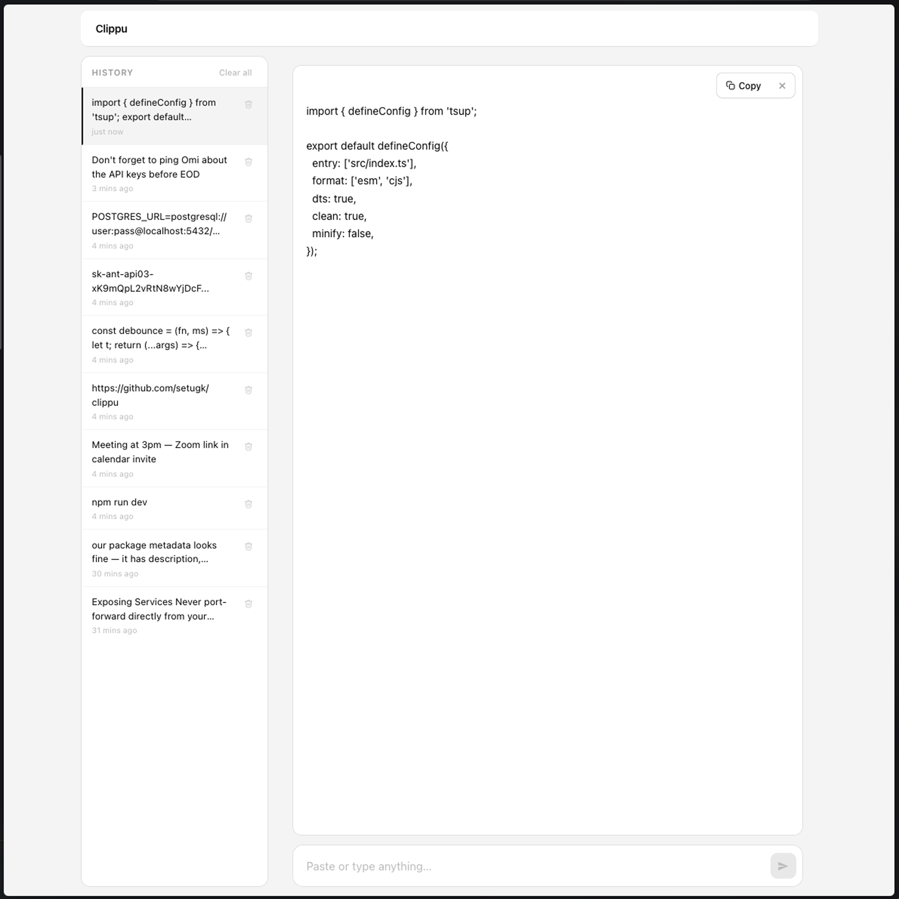
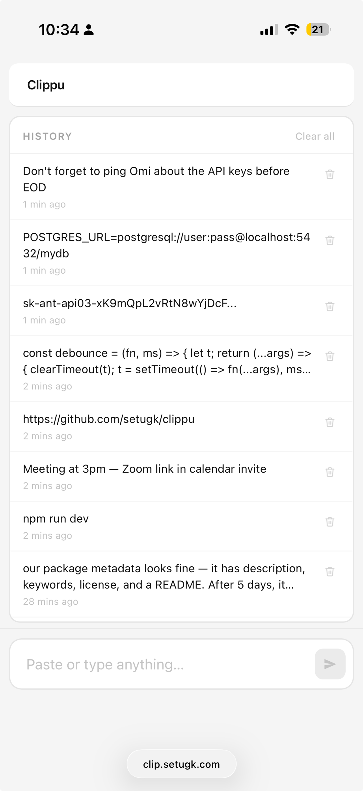

# Clippu

A self-hosted shared clipboard. Share text between devices in seconds — no accounts, no cloud, no friction.

I built this because I needed a fast way to move text between a work laptop and a personal laptop. iCloud isn't available on work machines, and Notion felt like overkill for "paste this URL somewhere I can grab it."





## What it does

- Paste text on one device, copy it on another
- History of the last 25 clips, always visible
- Click any item to preview the full text
- Auto-syncs across all open tabs every 2 seconds — no refresh needed
- Works on desktop and mobile

## Stack

Single Python file. Flask backend, vanilla JS frontend — no build step, no bundler, no CDN dependencies. History stored as a JSON file on disk.

## Run it

```bash
docker compose up -d
```

That's it. Open `http://localhost:5050`.

```yaml
# docker-compose.yml
services:
  clipboard:
    build: .
    container_name: clipboard
    restart: unless-stopped
    ports:
      - "5050:5000"
    volumes:
      - ./data:/data
```

## Remote access (optional)

If you want to access it from outside your home network, put it behind a [Cloudflare Tunnel](https://developers.cloudflare.com/cloudflare-one/connections/connect-networks/) with a Zero Trust Access policy. That way you get your own `clip.yourdomain.com` with email OTP authentication — no passwords to manage, no port forwarding.

## License

MIT
